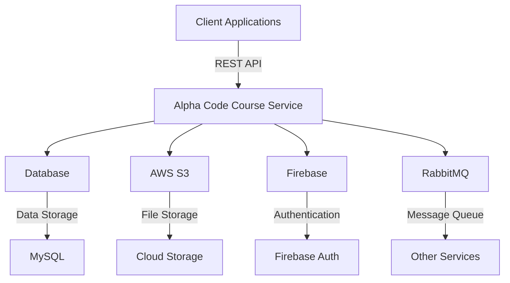

# Alpha Code Course Service

## Description
Alpha Code Course Service is a robust backend service designed to manage and deliver course-related functionalities for the Alpha Code platform. Built with scalability, security, and performance in mind, this service handles everything from course creation to user progress tracking.

---

## Introduction
The Alpha Code Course Service is a core component of the Alpha Code ecosystem. It provides APIs and integrations for managing courses, lessons, bundles, and user progress. Designed with modern software engineering principles, it ensures high availability, fault tolerance, and seamless integration with other services.

---

## Key Features
- **Course Management**: Create, update, and delete courses with ease.
- **Lesson Tracking**: Track user progress through lessons and sections.
- **Bundle Support**: Group courses into bundles for better organization.
- **Certificate Issuance**: Automatically generate certificates upon course completion.
- **Rate Limiting**: Protect APIs with IP-based rate limiting.
- **Cloud Integration**: Leverage AWS S3 for storage and Firebase for authentication.
- **RabbitMQ Messaging**: Ensure reliable communication between services.
- **OpenAPI Documentation**: Comprehensive API documentation for developers.

---

## Overall Architecture

The architecture is designed to ensure modularity, scalability, and fault tolerance. Each component is loosely coupled, enabling independent scaling and maintenance.

---

## Installation
### Prerequisites
- Java 17 or higher
- Maven 3.8+
- Docker & Docker Compose
- AWS CLI (configured with appropriate credentials)
- Firebase service account JSON file

### Steps
1. Clone the repository:
   ```bash
   git clone https://github.com/your-org/alpha-code-course-service.git
   cd alpha-code-course-service
   ```
2. Build the project:
   ```bash
   ./mvnw clean install
   ```
3. Start the services using Docker Compose:
   ```bash
   docker-compose up -d
   ```

---

## Running the Project
### Local Development
1. Run the application:
   ```bash
   ./mvnw spring-boot:run
   ```
2. Access the API documentation at:
   [http://localhost:8080/swagger-ui.html](http://localhost:8080/swagger-ui.html)

### Production
1. Build the Docker image:
   ```bash
   docker build -t alpha-code-course-service .
   ```
2. Deploy the image to your container orchestration platform (e.g., Kubernetes, ECS).

---

## Environment Configuration
The application requires the following environment variables:

| Variable Name          | Description                          | Example Value              |
|------------------------|--------------------------------------|----------------------------|
| `SPRING_PROFILES_ACTIVE` | Active Spring profile               | `dev`, `prod`              |
| `AWS_ACCESS_KEY_ID`    | AWS access key                      | `your-access-key`          |
| `AWS_SECRET_ACCESS_KEY`| AWS secret key                      | `your-secret-key`          |
| `FIREBASE_CONFIG_PATH` | Path to Firebase service account JSON| `/path/to/firebase.json`   |
| `RABBITMQ_HOST`        | RabbitMQ host                       | `localhost`                |
| `DATABASE_URL`         | Database connection URL             | `jdbc:mysql://localhost:3306/db` |

---

## Folder Structure
```
alpha-code-course-service/
├── src/
│   ├── main/
│   │   ├── java/
│   │   │   └── site/alphacode/alphacodecourseservice/
│   │   │       ├── controller/    # REST controllers
│   │   │       ├── service/       # Business logic
│   │   │       ├── repository/    # Data access layer
│   │   │       ├── entity/        # JPA entities
│   │   │       ├── config/        # Configuration classes
│   │   │       └── ...
│   ├── resources/
│   │   ├── application.yml        # Main configuration file
│   │   └── firebase/              # Firebase credentials
├── Dockerfile                      # Docker image definition
├── docker-compose.yml              # Docker Compose configuration
├── pom.xml                         # Maven project file
└── README.md                       # Project documentation
```

---

## Contribution Guidelines
We welcome contributions from the community! To contribute:
1. Fork the repository.
2. Create a feature branch:
   ```bash
   git checkout -b feature/your-feature
   ```
3. Commit your changes:
   ```bash
   git commit -m "Add your feature"
   ```
4. Push to your branch:
   ```bash
   git push origin feature/your-feature
   ```
5. Open a pull request.

Please ensure your code adheres to our coding standards and includes tests.

---

## License
This project is licensed under the MIT License. See the [LICENSE](LICENSE) file for details.

---

## Roadmap
- [x] Initial release with core features
- [ ] Add support for GraphQL APIs
- [ ] Implement advanced analytics for course progress
- [ ] Enhance security with OAuth2 integration
- [ ] Expand cloud provider support (e.g., Azure, GCP)

Stay tuned for updates!